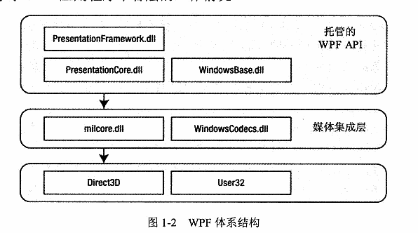

## 简述
wpf体系结构
  

C# 编程宝典p9

## wpf类层次结构
1. system.threading.dispatcherObject类    
    wpf是单线程亲和(single-thread affinity,STA模型)，整个用户界面由单个线程拥有。从另一个线程与用户界面元素交互是不安全的。通过继承dispatcherObject类，用户界面每个元素检查代码是否在正确线程上运行
2. system.windows.dependencyObject  
    在wpf中通过属性和元素进行交互
3. system.windows.media.visual类  
    在wpf中显示的每一个元素本质都是visual对象。可以将visual类视为绘图对象,封装了绘图指令、如何执行绘图的具体细节和基本功能
4. system.windows.UIElement  
    UIElement增加了对wpf本质特性的支持，如布局、输入、焦点、事件。UIElement还增加了对命令的支持。
5. system.windows.frameworkElement  
    实现了一些由UIElement类定义的成员
6. system.windows.shapes.shape      
    基本的形状类 Rectangle/Polygon/Ellipse/Line/Path都继承自该类
7. system.windows.controls.control  
    control是与用户进行交互的元素
8. system.windows.controls.contentcontrol  
    具有单一内容的控件的基类
9. system.windows.controls.itemscontrol  
    所有显示选项的集合
10. system.windows.controls.panel
    所有布局类的基类