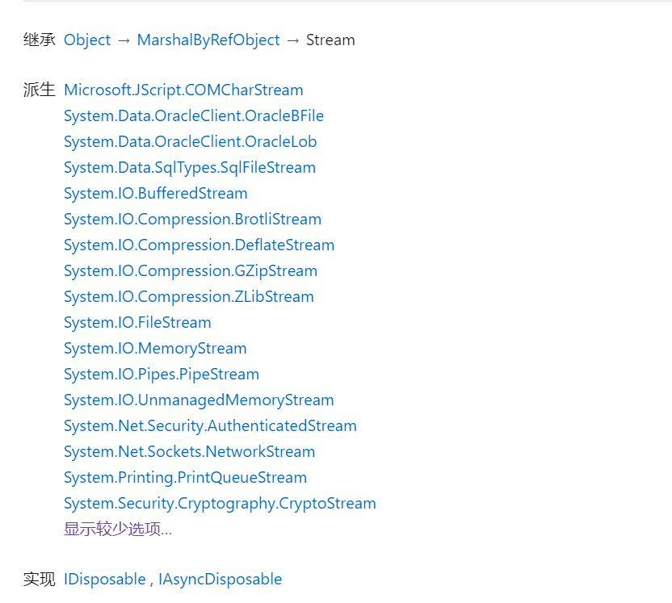

## C# Stream类
主要的派生类如下：
- FileStream 使用文件作为后备设备
- BufferStream 使用缓冲区作为后备设备，用来增强性能的中间存储
- MemoryStream 使用内存作为后备存储，执行IO速度快
- NetworkStream 没有后备设备，用于在网络上传递数据
- CryptoStream 和其他流配合使用，执行加密解密操作
  [stream官方](https://docs.microsoft.com/zh-cn/dotnet/api/system.io.stream?view=net-6.0)

## 简介
在计算机编程中，流就是一个类的对象，很多文件的输入输出操作都以类的成员函数的方式来提供。  

计算机中的流其实是一种信息转换。它是一种有序流。因此相对于某一对象，通常我们把对象接收外界的信息输入（Input）称为输入流，相应地从对象向外 输出（Output）信息为输出流，合称为输入/输出流（I/O Streams）。  

`对象间进行信息或者数据的交换时总是先将对象或数据转换为某种形式的流，再通过流的传输，到达目的对象后再将流转换为对象数据。`  

流提供一种向后备存储器写入字节和从后备存储器读取字节的方式。


TODO:: 需要再次了解基本的Stream派生类的使用
## Stream基类
- Flush()   
当使用流写文件时，数据流先进入缓冲区，而不会立即写入文件，当执行这个方法后，缓冲区文件会立即注入基础流。  
- Seek(long offset,SeekOrigin origin)  
Seek方法是重新设计流的一个位置  
```
Stream. Seek(-3,Origin.End);  表示在流末端往前数第3个位置
Stream. Seek(0,Origin.Begin); 表示在流的开头位置
Stream. Seek(3,Orig`in.Current); 表示在流的当前位置往后数第三个位置
```

## 参考
https://blog.csdn.net/denb98569/article/details/101356896
[Stream 基类](https://www.cnblogs.com/crazytomato/p/8274803.html)