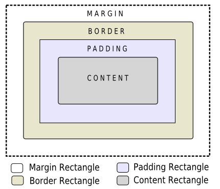

## 1. 简介
1. Qt样式表允许用户定制widgets组件外观，子类化QStyle也可以定制外观。Qt样式表的概念术语语法源自于CSS层叠样式表

## 2. 编程
1. 代码中设置
QApplication::setStyleSheet();  
QWidget::setStyleSheet();
2. 通过文件设置QSS 
将QSS代码写入.qss文件，将.qss文件加入资源文件qrc.qrc中  
示例如下：
````C++
QPushButton *btn = new QPushButton;
btn->setText("hello");
QFile file("./qss/dev.qss");
file.open(QIODevice::RradOnly);
QString stylesheet = QLatin1String(file.readAll());
btn->setStyleSheet(stylesheet);
file.close;
````

## 3. 样式表语法
### 1. 样式规则
样式表语法由选择器和声明组成，Qt样式表的大小写不敏感，  
多个选择器可以指定同一个声明，使用","分割选择器。   
也可以指定多个声明，使用";"分割

### 2. 选择器类型

| 选择器 | 示例 | 说明 |
| ------ | ------| ------ |
| 通用选择器 | * | 匹配所有组件 |
| 类型选择器 | QPushButton | 匹配所有QPushButton子类实例|
| 属性选择器 | QPushButton[flat="false"] | 匹配QPushButton的属性为flat=false的实例。属性分为静态属性和动态属性。静态属性通过Q_PROPERTY()指定，动态属性使用setProperty指定 |
| 类选择器 | .QPushButton | 匹配QPushButton的实例，子类除外 |
| ID选择器 | QPushButton#okButton | 匹配名称为okButton的QPushButton实例 |
| 后代选择器 | QDialog QPushButton | 匹配QDialog后代的所有QPushButton |
| 子选择器 | QDialog > QPushButton | 匹配QDialog子类对象QPushButton的所有实例 |
| | |

### 3. 子控件选择器
对于样式复杂的组件，需要访问组件的子控件，如QCombox下拉按钮或QSpinBox上下箭头等  
eg: QComBox::drop-down {image:url(dropdown.png)}  
常用的辅助控制器：

| 名称 | 说明 |
| ------ | ------ |
| ::indicator | 单选框、复选框、可选菜单项可选群组项指示器 |
| ::menu-indicator | 按钮的菜单指示器 |
| ::item | 菜单、菜单栏或状态栏项 |
| ::up-button | 微调框或滚动条的向下按钮 |
| ::down-button | 微调框或滚动条的向上按钮 |
| ::up-arrow | 微调框、滚动条或标题视图的向上按钮 |
| ::down-arrow | 微调框、滚动条或标题视图的向下按钮 |
| ::drop-down | 组合框的下拉箭头 |
| ::title | 群组框的标题 |
| | |

### 4. 伪选择器
选择器可能包含限制基于组件状态的规格应用的伪状态。伪状态出现在选择器尾部  
eg QPushButton:hover{ color : white}  
同时伪状态可以取反 QPushButton:!hover{ color : red}  
状态组合：  
QCheckBox:hover:!press{ color = bule}  
QComboBox::drop-down:hover{ image: url(dropdown_bright.png)}  

| 常用状态 | 说明 |
|------ | ------- |
| :disabled | 禁用的窗口组件 |
| :enabled | 启用的窗口组件 |
| :focus | 窗口部件有输入焦点 |
| :hover | 鼠标悬浮 |
| :pressed | 鼠标按键点击 |
| :checked | 按钮被选中 |
| :unchecked | 按钮未被选中 |
| :indeterminate | 按钮部分选中 |
| :open | 窗口处于打开或扩展状态 |
| :closed | 窗口部件处于关闭或销毁状态 |
| :on | 窗口部件的状态是on |
| :off | 窗口部件的状态是off |

### 5. 冲突处理
多个样式规则使用多个值指定同一个属性时产生的冲突，需要考虑选择器的特征。  
如果具有相同的选择器特性，则第二条规格优先

### 6. 级联

### 7. 继承

### 8. C++命名空间内部组件

### 9. 设置QObject属性
从Qt4.3开始，任何可以被设计的Q_PROPERTY都可以使用qproperty-\<property name>

## 4. 样式表定制Qt组件
### 1. 盒子模型
使用样式表时，每个组件会被当做四个同心矩形：空白矩形、边界矩形、衬底矩形、内容矩形的盒子  
  
margin、border、padding默认属性都是0，此时他们的大小一致。  
background-image 修改组件的背景，默认在边界border矩形被绘制，使用background-chip修改，使用background-repeat、background-origin控制背景图片的重复和来源。  

为提供随组件大小缩放的皮肤和背景，必须使用border-image属性。当background-image和border-image都被指定时，border-image在background-image上

渲染规则的步骤如下：
1. 为整个渲染操作设置clip(border-radius)
2. 绘制背景(background-image)
3. 绘制边界(border-image,border)
4. 绘制覆盖图像(image)

### 2. 子控件
一个组件可以看做为一个子控件树


## 参考资料
1. https://www.cnblogs.com/lsgxeva/p/7816938.html