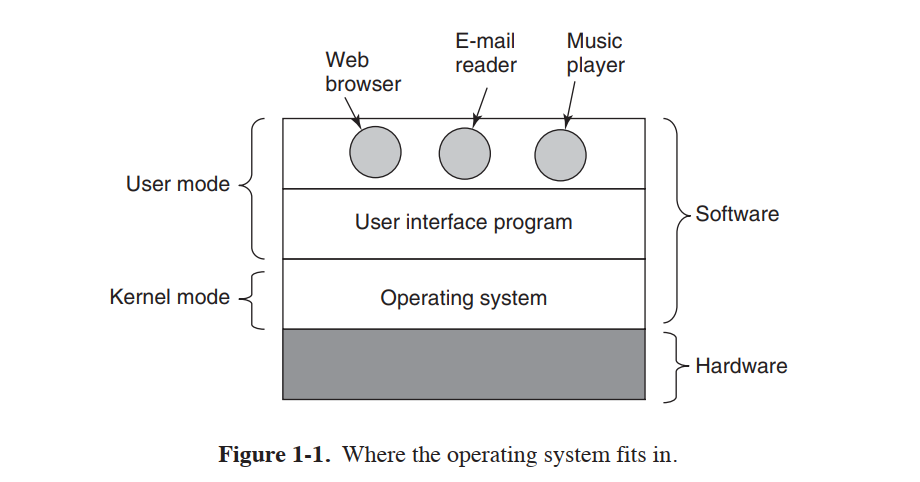

# 操作系统简介
一个现代操作系统集成了one or more processors，some main memory，disks，printers, a keyboard, a mouse, a dispaly, network interfaces, and various other input/output devices.  
由operation system提供更加简单、快捷、有效的方式处理这些devices

大多数操作系统分为两个模式kernel mode(also called supervior mode) and user mode.  
大多数底层操作的软件都运行在kernel mode，this mode can completly access 所有硬件，执行所有机器指令等。剩下的软件在用户态。其中控制IO设备的指令禁止在用户态。  
  

the user interface program, shell or GUI(graphical user interface)是最底层的用户态软件