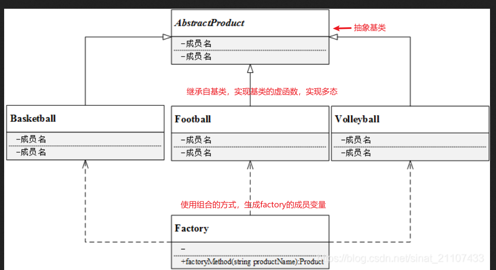

## 1. 简单工厂模式 设计思路  

抽象产品(abstractProduct)  
具体产品(concreteProduct)  
工厂(factory):在工厂里面new不同的具体产品，当新增具体产品时，需要修改工厂代码，不符合开闭原则

缺点：当新增具体产品工厂时，违背了开闭原则(对扩展开放，对修改关闭)，在扩展功能时修改了既有的代码

## 2. 工厂方法模式

 * 抽象工厂(abstractFactory):所有生成具体产品工厂类的基类，提供工厂类的公共方法
 * 具体工厂(concreteactory):生产具体的产品
 * 抽象产品(abstractProduct):所有产品的基类，提供产品类的公共方法
 * 具体产品(concreteProduct):具体的产品类

 抽象产品  
 具体产品  
 抽象工厂  
 具体工厂  

 当新增产品时，从抽象产品中继承实现一个具体产品类，再生成一个具体工厂类进行对应。此方法就优化了简单工厂模式的缺陷  

 * 优点：
    - 多态性设计
    - 增强了系统的可扩展性，符合开闭原则
* 缺点：
    - 新增新产品时，具体产品和工厂成对增加，增加了系统的复杂性
    - 工厂和产品都引入了抽象层，增加了系统抽象层此的理解难度

## 3. 抽象工厂模式

## 参考链接
1. https://blog.csdn.net/sinat_21107433/article/details/102598181
2. https://www.cnblogs.com/schips/p/12306851.html(TODO::)